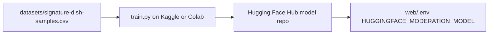

# Hugging Face training guide — Signature Dish moderation

**Last updated:** 2026-06-11  
**Status:** Ready to run — custom model not trained yet. Pre-trained `unitary/unbiased-toxic-roberta` is live in the app.  
**Goal:** Train a binary **allowed / blocked** classifier, push it to the Hub, plug it into the game with one env var.

---

## Big picture



Your app already calls the Hub via `router.huggingface.co`. After training you only change:

```bash
HUGGINGFACE_MODERATION_MODEL=YOUR_USERNAME/food-truck-moderation-v1
```

No TypeScript changes required.

---

## Phase 0 — Accounts and tokens (15 min)

1. **Hugging Face account:** [huggingface.co/join](https://huggingface.co/join)
2. **Create a Write token:** [huggingface.co/settings/tokens](https://huggingface.co/settings/tokens)
   - Name: `food-truck-training`
   - Permissions: **Read** + **Write** (for `push_to_hub`)
   - Also enable **Inference Providers** (for testing the model from the app)
3. **Optional Kaggle account:** [kaggle.com](https://www.kaggle.com) — free GPU notebooks

Keep the token secret. Never commit it. Use Kaggle **Secrets** or shell env `HF_TOKEN`.

---

## Phase 1 — Build your dataset (30–60 min)

Start with the repo file:

[`ml/text-moderation/datasets/signature-dish-samples.csv`](../../ml/text-moderation/datasets/signature-dish-samples.csv)

We expanded it with game-specific rows including **“a cake made of cockroaches” → allowed**.

### Your job

1. Open the CSV in a spreadsheet editor.
2. Add **at least 30–50 more rows** you care about (we have ~24 now).
3. Focus on **edge cases** the pre-trained model got wrong:
   - Gross-but-funny food → `allowed`
   - Real slurs / hate / sexual / threats → `blocked`
4. Read labeling rules: [`ml/text-moderation/datasets/README.md`](../../ml/text-moderation/datasets/README.md)

### Optional: public data

Later, mix in Jigsaw / Civil Comments toxicity data (the training script can pull a subset automatically). For the first POC, **game CSV only is fine** — use `--no-jigsaw`.

---

## Phase 2 — Train on Kaggle (recommended, ~1 hour)

### Step 1: New notebook

1. [kaggle.com/code](https://www.kaggle.com/code) → **New Notebook**
2. **Settings → Accelerator → GPU T4 x2** (or any free GPU)
3. **Add-ons → Secrets** → add `HF_TOKEN` = your Write token

### Step 2: Upload project files

**Option A — Upload CSV only (simplest)**

- Upload `signature-dish-samples.csv` to `/kaggle/input/` or the notebook file browser
- Paste the training cells below

**Option B — Clone from GitHub**

If this repo is on GitHub, add your repo as a Kaggle dataset or `git clone` in the notebook.

### Step 3: Notebook cells

**Cell 1 — Install**

```python
!pip install -q transformers datasets accelerate evaluate scikit-learn huggingface_hub
```

**Cell 2 — Login**

```python
from huggingface_hub import login
import os
login(token=os.environ["HF_TOKEN"])  # from Kaggle Secrets
```

**Cell 3 — Copy CSV path**

```python
# If you uploaded the CSV to Kaggle input:
CSV_PATH = "/kaggle/input/signature-dish-samples/signature-dish-samples.csv"
# Or if copied into working dir:
# CSV_PATH = "signature-dish-samples.csv"
```

**Cell 4 — Run training**

Upload `train.py` or paste its contents, then:

```python
HF_USERNAME = "your-hf-username"  # ← change this
REPO_ID = f"{HF_USERNAME}/food-truck-moderation-v1"

!python train.py \
  --csv {CSV_PATH} \
  --no-jigsaw \
  --epochs 5 \
  --push-to-hub {REPO_ID}
```

First run: use `--no-jigsaw` and `--epochs 3–5`. Training takes a few minutes on GPU.

### Step 4: Check metrics

The script prints test metrics, e.g.:

```
accuracy: 0.95
precision_blocked: ...
recall_blocked: ...
f1_blocked: ...
```

Save these in [`ml/text-moderation/eval/run-notes.md`](../../ml/text-moderation/eval/run-notes.md) (create after your first run).

**What to watch**

- **False positives:** allowed gross food marked blocked → add more `allowed` examples like that
- **False negatives:** slurs slipping through → add `blocked` examples

---

## Phase 3 — Test on the Hub (10 min)

1. Open `https://huggingface.co/YOUR_USERNAME/food-truck-moderation-v1`
2. Open the **Inference** widget (or use API):

```bash
curl -s -X POST \
  "https://router.huggingface.co/hf-inference/models/YOUR_USERNAME/food-truck-moderation-v1" \
  -H "Authorization: Bearer $HF_TOKEN" \
  -H "Content-Type: application/json" \
  -d '{"inputs": "a cake made of cockroaches"}'
```

Expect something like:

```json
[{"label": "allowed", "score": 0.92}, {"label": "blocked", "score": 0.08}]
```

Try your failure cases from the live app.

---

## Phase 4 — Wire into the game (2 min)

In `web/.env`:

```bash
HUGGINGFACE_MODERATION_MODEL=YOUR_USERNAME/food-truck-moderation-v1
TEXT_MODERATION_THRESHOLD=0.5
```

Restart `yarn dev`. Submit Signature Dish text again.

Your custom model returns **`allowed` / `blocked`** labels (not `toxicity` / `obscene`). The UI will show those label names with scores.

### Threshold tuning

- Default threshold: **0.5**
- If gross food still blocked → **raise** to `0.6`–`0.7` or add training rows
- If slurs slip through → **lower** slightly or add blocked examples

Document your choice in `ml/text-moderation/eval/threshold.md`.

---

## Phase 5 — Iterate (ongoing)

| Problem | Fix |
|---------|-----|
| Cockroaches cake blocked | Add to CSV as `allowed`, retrain |
| Slur gets through | Add to CSV as `blocked`, retrain |
| Model too big / slow | Keep `distilbert-base-uncased` (default in `train.py`) |
| Want more data | Remove `--no-jigsaw` to mix Jigsaw subset |

Bump version when re-pushing: `food-truck-moderation-v2`, update env var.

---

## Alternative: train locally or Google Colab

From repo root:

```bash
cd ml/text-moderation
python -m venv .venv
source .venv/bin/activate
pip install -r requirements.txt
huggingface-cli login

HF_TOKEN=hf_... python train.py \
  --no-jigsaw \
  --epochs 5 \
  --push-to-hub YOUR_USERNAME/food-truck-moderation-v1
```

Colab: same commands; **Runtime → Change runtime type → GPU**.

---

## Files in this repo

| File | Purpose |
|------|---------|
| [`ml/text-moderation/train.py`](../../ml/text-moderation/train.py) | Training script |
| [`ml/text-moderation/datasets/signature-dish-samples.csv`](../../ml/text-moderation/datasets/signature-dish-samples.csv) | Your labeled data |
| [`ml/text-moderation/requirements.txt`](../../ml/text-moderation/requirements.txt) | Python deps |
| [`docs/ai-generated/TEXT_MODERATION.md`](./TEXT_MODERATION.md) | App integration |

---

## Checklist

- [ ] HF account + Write token with Inference Providers
- [ ] Expanded CSV (50+ rows)
- [ ] Kaggle notebook trained with GPU
- [ ] Model visible on Hub
- [ ] Curl test: cockroaches cake → `allowed`
- [ ] `web/.env` updated
- [ ] Live Signature Dish test in game
- [ ] Metrics + threshold written in `ml/text-moderation/eval/`

When you finish Phase 2, paste your test metrics or any errors here and we can tune the dataset or threshold together.
