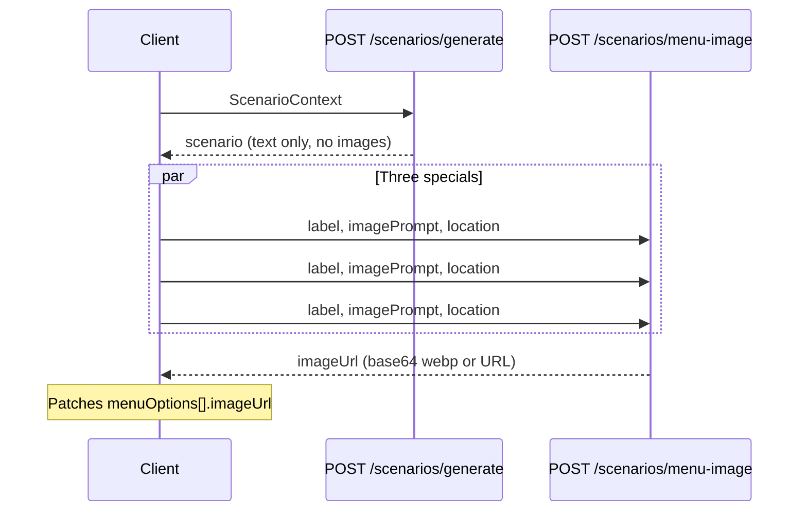

# Menu special images

## Flow



Scenario generation intentionally does **not** wait for images (`validate-scenario.ts` does not call image generation).

## Verdict refetch

If the player submits before card images finish:

1. `applyTurn` stores `menuImageUrl` from the option (may be undefined), plus `imagePrompt` and `dayLocation` on `lastMenuFeedback`.
2. `MenuFeedbackBanner` mounts with no URL → calls the same `menu-image` API → shows loading state → displays image and calls `onVerdictImageLoaded` to persist URL on `gameState`.

The verdict banner stays visible during the inter-turn loading spinner so the refetch can run immediately.

## Configuration

See `web/.env.example`. Fastest practical setup:

```bash
OPENAI_IMAGE_MODEL=gpt-image-1-mini
```

Disable entirely:

```bash
MENU_IMAGES_ENABLED=false
```

## Implementation reference

- `web/src/lib/ai/generate-menu-images.ts`
- `web/src/hooks/useMenuImages.ts`
- `web/src/components/MenuFeedbackBanner.tsx`
