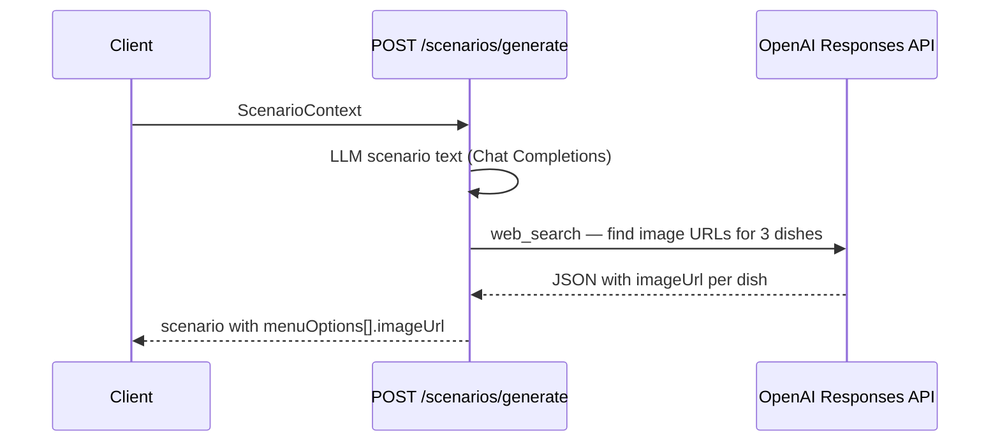

# Menu special images

## Flow



After scenario text is generated, **one OpenAI Responses API call** with the `web_search` tool finds a real HTTPS image URL for each menu special. No TheMealDB, Pexels, or Wikimedia integrations.

Each menu option includes an `imageSearchTerm` from the scenario LLM (plain dish name) to guide the image search.

If web search fails, menu cards show the utensil placeholder.

## Configuration

```bash
OPENAI_API_KEY=           # required (same key as scenario generation)
OPENAI_SEARCH_MODEL=        # optional, default gpt-4o-mini
```

Web search incurs additional OpenAI tool-call fees per scenario.

## Implementation reference

- `web/src/lib/ai/resolve-menu-image-url.ts` — batched web search + URL attach
- `web/src/lib/ai/generate-scenario.ts` — calls attach after moderation
- `web/src/components/MenuSpecialImage.tsx` — display + error fallback
