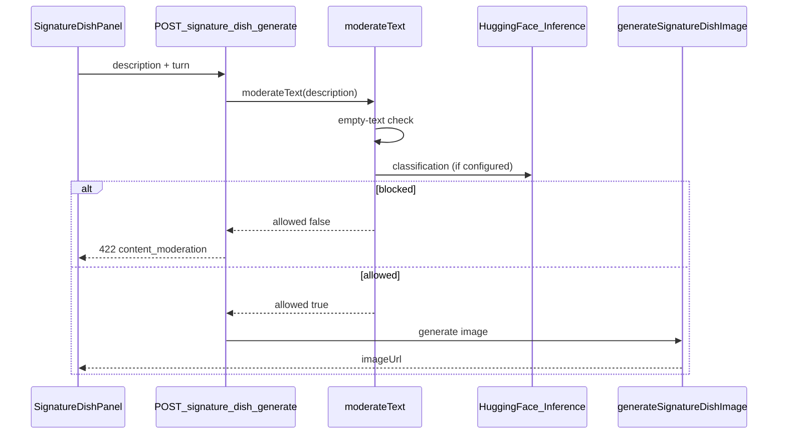

# Text Moderation

**Last updated:** 2026-06-06

User-authored Signature Dish descriptions are moderated server-side before OpenAI image generation runs.

## Platform split

| Where | What |
|-------|------|
| **Kaggle + Python** | Train/evaluate models — see [`ml/text-moderation/README.md`](../../ml/text-moderation/README.md) |
| **Hugging Face Hub** | Store model artifact; Inference API for runtime |
| **Next.js (`web/`)** | `moderateText()` TypeScript interface + API gate |

## Flow



## Module layout

```
web/src/lib/moderation/
  types.ts
  config.ts
  moderate-text.ts      # public entry
  providers/
    rules.ts            # empty-text validation (first pass)
    huggingface.ts      # HF Inference API (primary)
    openai.ts           # optional fallback
  index.ts
```

## Provider order

1. **Rules** — reject empty/whitespace-only text (always when enabled)
2. **Primary** — `TEXT_MODERATION_PROVIDER` (`huggingface` or `openai`)
3. **Fallback** — the other remote provider if primary fails
4. **Fail-open** — if no provider is reachable, allow (log warning)

When a provider returns a confident **block**, the request fails closed with HTTP 422.

## Env vars

```bash
TEXT_MODERATION_ENABLED=true
TEXT_MODERATION_PROVIDER=huggingface   # huggingface | openai | rules-only
HUGGINGFACE_API_KEY=                   # User Access Token with "Inference Providers" permission
HUGGINGFACE_MODERATION_MODEL=unitary/unbiased-toxic-roberta
# HUGGINGFACE_INFERENCE_BASE_URL=https://router.huggingface.co/hf-inference
TEXT_MODERATION_THRESHOLD=0.5
```

Runtime calls `https://router.huggingface.co/hf-inference/models/{model}` — **not** the retired `api-inference.huggingface.co` hostname.

Swap `HUGGINGFACE_MODERATION_MODEL` to your fine-tuned Hub repo after Kaggle training — no code change.

## API behaviour

`POST /api/signature-dish/generate`

- **422** `errorCode: content_moderation` — blocked; image generation skipped
- **200** — moderation passed; image generated as before

User-facing blocked copy: *"That description doesn't fit our family-friendly kitchen — try another dish idea."*

## UI

- `SignatureDishStatus`: `generating` | `ready` | `blocked` | `error`
- Dev panel shows moderation scores/labels per Signature Dish request (development only)

## Tests

```bash
cd web && npm test
```

- `lib/moderation/moderate-text.test.ts`
- `lib/moderation/providers/rules.test.ts`
- `lib/moderation/providers/huggingface.test.ts`
- `app/api/signature-dish/generate/route.test.ts`

## Related docs

- [`SIGNATURE_DISH.md`](./SIGNATURE_DISH.md) — Signature Dish feature
- [`ml/text-moderation/README.md`](../../ml/text-moderation/README.md) — Kaggle training lane

## Note on scenario moderation

AI-generated scenario text still uses OpenAI Moderation in `web/src/lib/ai/moderation.ts`. This module is specifically for **user free-text** Signature Dish input.
